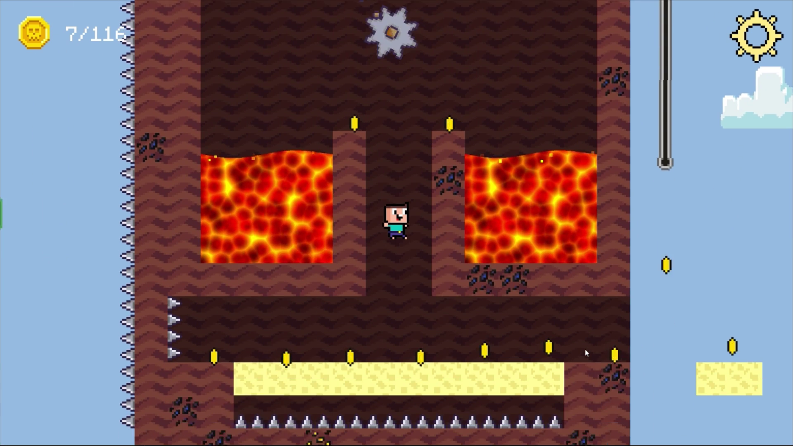

# Super Noob Parkour

A platformer game made with Phaser 3. You play as a Noob, a Minecraft character, and your goals are to reach another portal and also to collect all coins. You can play the game [on itch.io](https://m039.itch.io/super-noob-parkour) or [on Yandex Games](https://yandex.ru/games/app/208056). The game was initially released on Yandex Games.

## Available Commands

You can read instructions how to use the project [here](docs/README_old.md).

| Command | Description |
|---------|-------------|
| `npm install` | Install project dependencies |
| `npm run watch` | Build project and open web server running project, watching for changes |
| `npm run dev` | Builds project and open web server, but do not watch for changes |
| `npm run build` | Builds code bundle with production settings (minification, no source maps, etc..) |

## License

The license for source code is GPL-3.0, for the art is [CC-BY 4.0](http://creativecommons.org/licenses/by/4.0/).

## Screenshot

